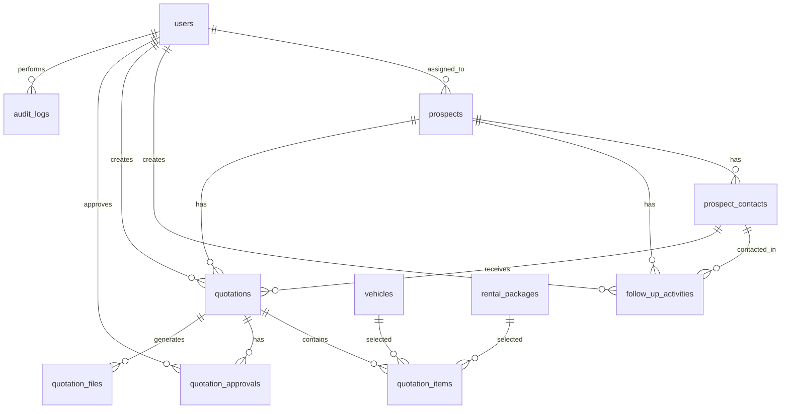

# PROJECT HAN — Website 1
# B2B Fleet Rental CRM & Quotation System

> **Tech Stack:** Full Laravel  
> **Target:** Portfolio kerja untuk posisi Web Developer / Full Stack Developer  
> **Project Type:** Business Web Application / CRM / Quotation / Approval System  
> **Repository Name:** `b2b-fleet-rental-crm-laravel`

---

## 1. Identitas Project

### 1.1 Nama Project
**B2B Fleet Rental CRM & Quotation System**

### 1.2 Deskripsi Singkat
Website ini adalah sistem CRM untuk perusahaan penyewaan kendaraan B2B yang membantu tim sales mengelola prospek perusahaan, data PIC, aktivitas follow-up, pembuatan quotation, approval penawaran, dan pemantauan pipeline penjualan.

Project ini dibuat sebagai portfolio Laravel yang menunjukkan kemampuan membangun sistem bisnis nyata, bukan hanya CRUD sederhana.

### 1.3 Tujuan Utama
Membangun aplikasi Laravel yang mampu:

1. Mengelola data prospek perusahaan secara terstruktur.
2. Menyimpan data PIC seperti Procurement, Purchasing, General Affair, HR, dan Operation.
3. Mencatat riwayat komunikasi dan follow-up sales.
4. Membuat quotation penyewaan kendaraan.
5. Melakukan approval quotation oleh manager.
6. Menghasilkan dokumen PDF penawaran.
7. Menampilkan dashboard pipeline dan performa sales.
8. Menerapkan keamanan aplikasi berbasis role, policy, validasi, rate limiting, dan audit log.

---

## 2. Latar Belakang Masalah

Banyak perusahaan rental kendaraan B2B masih menghadapi masalah dalam proses akuisisi pelanggan baru. Data calon pelanggan sering tersebar di spreadsheet, kontak PIC tidak terdokumentasi rapi, proses follow-up tidak terpantau, dan pembuatan penawaran harga masih manual.

Masalah tersebut menyebabkan:

1. Prospek potensial mudah terlewat.
2. PIC penting seperti Procurement, Purchasing, dan General Affair sulit dilacak.
3. Sales tidak memiliki histori komunikasi yang jelas.
4. Manager sulit memantau status pipeline.
5. Penawaran harga tidak memiliki proses approval yang rapi.
6. Dokumen quotation tidak konsisten.
7. Data performa sales sulit dianalisis.

Project ini menyelesaikan masalah tersebut melalui sistem CRM internal yang dirancang khusus untuk bisnis penyewaan kendaraan korporat.

---

## 3. Target Pengguna

| Role | Deskripsi |
|---|---|
| Admin | Mengelola user, master kendaraan, master paket sewa, dan konfigurasi dasar sistem. |
| Sales | Mengelola prospek, PIC, follow-up, dan membuat quotation. |
| Sales Manager | Melihat pipeline, melakukan approval/reject quotation, dan memantau performa sales. |
| Finance | Melihat quotation yang sudah disetujui dan data estimasi nilai kontrak. |

---

## 4. Scope Project

### 4.1 In Scope
Fitur yang wajib dibuat:

1. Authentication dan role management.
2. Dashboard utama.
3. Manajemen company prospect.
4. Manajemen contact person / PIC.
5. Follow-up activity log.
6. Pipeline status.
7. Vehicle master.
8. Rental package master.
9. Quotation creation.
10. Quotation item detail.
11. Quotation approval workflow.
12. Generate PDF quotation.
13. Export data prospect / quotation.
14. Audit log aktivitas penting.
15. Basic notification/reminder follow-up.
16. Search, filter, pagination.
17. Testing dasar.
18. README GitHub profesional.

### 4.2 Out of Scope untuk Versi 1
Fitur yang tidak wajib dibuat di awal:

1. Payment gateway.
2. Integrasi WhatsApp API asli.
3. Integrasi email SMTP production.
4. Mobile app.
5. GPS kendaraan.
6. ERP accounting penuh.
7. Multi-branch kompleks.
8. AI recommendation.

Catatan: fitur out of scope boleh dijadikan bagian **Future Enhancement** di README.

---

## 5. Core Problem Statement

**Bagaimana perusahaan penyewaan kendaraan B2B dapat mengelola prospek, PIC perusahaan, follow-up sales, quotation, dan approval penawaran dalam satu sistem CRM berbasis Laravel yang aman, rapi, dan siap dipresentasikan sebagai portfolio kerja?**

---

## 6. Value untuk Portfolio Kerja

Project ini harus menunjukkan bahwa developer mampu:

1. Membuat sistem Laravel berbasis masalah bisnis nyata.
2. Mendesain database relasional dengan baik.
3. Membangun autentikasi dan otorisasi berbasis role.
4. Membuat workflow approval.
5. Menghasilkan dokumen PDF.
6. Membuat dashboard manajemen.
7. Menulis kode yang rapi dan mudah dipahami.
8. Menerapkan validasi dan keamanan dasar yang kuat.
9. Menggunakan GitHub secara profesional.
10. Menjelaskan project saat interview kerja.

---

## 7. Recommended Tech Stack

### 7.1 Backend & Framework
- Laravel latest stable version.
- PHP latest stable yang didukung Laravel.
- MySQL atau MariaDB.
- Laravel Blade untuk tampilan.
- Laravel Eloquent ORM.
- Laravel Form Request Validation.
- Laravel Policies / Gates.
- Laravel Queues untuk pekerjaan asynchronous sederhana.
- Laravel Scheduler untuk reminder follow-up.

### 7.2 Frontend
- Blade Components.
- Tailwind CSS.
- Alpine.js untuk interaksi ringan.
- Chart.js atau ApexCharts untuk grafik dashboard.
- Data table custom sederhana.

### 7.3 Package yang Direkomendasikan
Gunakan package secukupnya. Jangan terlalu banyak agar project tetap terlihat bersih.

| Kebutuhan | Rekomendasi |
|---|---|
| Authentication | Laravel Breeze / Laravel starter kit bawaan |
| Role & Permission | Bisa manual dengan enum/role sederhana, atau Spatie Permission jika ingin lebih realistis |
| PDF | barryvdh/laravel-dompdf atau Snappy PDF |
| Excel Export | maatwebsite/excel |
| UI Interaction | Alpine.js |
| Chart | Chart.js / ApexCharts |
| Testing | PHPUnit / Pest |

### 7.4 Rekomendasi Pilihan Final
Untuk portfolio yang rapi dan tidak terlalu berat:

```txt
Laravel + Blade + Tailwind CSS + Alpine.js + MySQL + DomPDF + PHPUnit
```

---

## 8. Prinsip Desain Aplikasi

### 8.1 Prinsip Sistem
1. Sistem harus terasa seperti aplikasi internal perusahaan.
2. Jangan membuat tampilan seperti template AI generik.
3. Gunakan layout bersih, profesional, dan fungsional.
4. Hindari animasi berlebihan.
5. Prioritaskan kejelasan data, tabel, status, dan aksi.
6. Semua fitur harus punya alasan bisnis.
7. Setiap data penting harus memiliki status dan riwayat.

### 8.2 Prinsip UI/UX Manual
Gunakan konsep desain berikut:

1. **Sidebar navigation** untuk menu utama.
2. **Topbar** berisi search, user profile, dan quick action.
3. **Dashboard cards** untuk metrik penting.
4. **Pipeline board** untuk status prospek.
5. **Table-first interface** untuk data CRM.
6. **Drawer/modal** hanya untuk aksi ringan.
7. **Full page form** untuk input data besar seperti quotation.
8. **Status badge** untuk pipeline, approval, dan priority.
9. **Timeline activity** untuk histori follow-up.
10. **Empty state** yang profesional.

### 8.3 Tone Visual
Gunakan gaya:

- Modern corporate.
- Clean admin dashboard.
- Banyak whitespace.
- Typography jelas.
- Warna netral.
- Accent color secukupnya.
- Tidak terlalu ramai.

### 8.4 Referensi Gaya Visual Non-AI
Bukan berarti meniru penuh, tapi arah visualnya bisa seperti:

1. Linear-style dashboard: minimal, fokus, clean.
2. Notion-style data density: rapi dan informatif.
3. Stripe-style form clarity: form jelas dan profesional.
4. HubSpot-style CRM flow: pipeline dan activity mudah dipahami.

---

## 9. Modul Sistem

### 9.1 Modul Authentication
Fitur:

1. Login.
2. Logout.
3. Register user hanya oleh Admin.
4. Forgot password.
5. Change password.
6. Profile setting.
7. Session regeneration setelah login.
8. Login throttling.

Role access:

| Fitur | Admin | Sales | Manager | Finance |
|---|---:|---:|---:|---:|
| Login | Yes | Yes | Yes | Yes |
| Manage Users | Yes | No | No | No |
| Manage Prospects | Yes | Yes | View | View |
| Manage Contacts | Yes | Yes | View | View |
| Manage Follow-up | Yes | Yes | View | No |
| Create Quotation | Yes | Yes | No | No |
| Approve Quotation | No | No | Yes | No |
| View Approved Quotation | Yes | Yes | Yes | Yes |
| Manage Master Vehicles | Yes | No | View | View |
| Dashboard | Yes | Yes | Yes | Yes |
| Audit Log | Yes | No | View | No |

---

### 9.2 Modul Dashboard
Dashboard harus berbeda berdasarkan role.

#### Admin Dashboard
Menampilkan:

1. Total users.
2. Total prospects.
3. Total active quotations.
4. Total approved quotations.
5. Top sales.
6. Audit activity terbaru.

#### Sales Dashboard
Menampilkan:

1. Total prospek milik sales.
2. Follow-up hari ini.
3. Quotation draft.
4. Quotation rejected.
5. Deal bulan ini.
6. Prospek yang belum di-follow-up.

#### Manager Dashboard
Menampilkan:

1. Total pipeline value.
2. Quotation waiting approval.
3. Conversion rate.
4. Sales performance.
5. Prospek high priority.
6. Monthly deal forecast.

#### Finance Dashboard
Menampilkan:

1. Approved quotation.
2. Estimated contract value.
3. Quotation by month.
4. Customer ready for contract.

---

### 9.3 Modul Company Prospect
Data calon pelanggan perusahaan.

Fitur:

1. Create prospect.
2. Edit prospect.
3. Delete prospect soft delete.
4. Detail prospect.
5. Search prospect.
6. Filter berdasarkan status, industry, city, assigned sales.
7. Change pipeline status.
8. Assign prospect ke sales.
9. Mark as lost.
10. Convert to customer.

Data field:

| Field | Tipe | Keterangan |
|---|---|---|
| company_name | string | Nama perusahaan |
| industry | string | Industri |
| company_size | enum | small, medium, enterprise |
| address | text | Alamat |
| city | string | Kota |
| province | string | Provinsi |
| website | string nullable | Website perusahaan |
| source | enum | linkedin, referral, cold_email, website, event, manual |
| status | enum | new, contacted, meeting, quotation, negotiation, won, lost |
| priority | enum | low, medium, high |
| estimated_vehicle_need | integer | Estimasi kebutuhan kendaraan |
| assigned_sales_id | foreign id | Sales penanggung jawab |
| notes | text nullable | Catatan |

Business rule:

1. Company name wajib unik secara case-insensitive jika belum soft deleted.
2. Prospect tidak bisa menjadi `won` jika belum ada quotation approved.
3. Prospect status `lost` wajib memiliki alasan.
4. Prospect high priority wajib memiliki next follow-up date.

---

### 9.4 Modul Contact Person / PIC
Data PIC dari perusahaan prospek.

Fitur:

1. Create PIC.
2. Edit PIC.
3. Delete PIC.
4. Mark primary PIC.
5. Catat jabatan PIC.
6. Validasi email dan nomor telepon.
7. Hubungkan PIC dengan prospect.

Data field:

| Field | Tipe | Keterangan |
|---|---|---|
| prospect_id | foreign id | Perusahaan |
| name | string | Nama PIC |
| position | enum/string | Procurement, Purchasing, GA, HR, Operation, Director |
| email | string nullable | Email PIC |
| phone | string nullable | Nomor telepon |
| linkedin_url | string nullable | Profil LinkedIn |
| is_primary | boolean | PIC utama |
| notes | text nullable | Catatan |

Business rule:

1. Satu prospect minimal disarankan punya satu PIC utama.
2. Hanya boleh ada satu primary PIC per prospect.
3. Email harus valid jika diisi.
4. Nomor telepon tidak boleh mengandung huruf.

---

### 9.5 Modul Follow-up Activity
Mencatat aktivitas komunikasi sales dengan prospek.

Fitur:

1. Add follow-up activity.
2. Edit follow-up activity.
3. Delete activity hanya oleh owner/admin.
4. Timeline activity di detail prospect.
5. Next follow-up reminder.
6. Filter activity by type.

Activity type:

- Call.
- Email.
- LinkedIn message.
- Meeting.
- Site visit.
- Proposal sent.
- Negotiation.
- Internal note.

Data field:

| Field | Tipe | Keterangan |
|---|---|---|
| prospect_id | foreign id | Perusahaan |
| contact_id | foreign id nullable | PIC terkait |
| user_id | foreign id | Sales yang melakukan aktivitas |
| activity_type | enum | Jenis aktivitas |
| activity_date | datetime | Tanggal aktivitas |
| summary | string | Ringkasan |
| detail | text nullable | Detail aktivitas |
| next_follow_up_at | datetime nullable | Jadwal follow-up berikutnya |
| outcome | enum nullable | positive, neutral, negative, no_response |

Business rule:

1. Follow-up tidak boleh dibuat untuk prospect yang sudah `lost`, kecuali diubah kembali statusnya.
2. Jika outcome `positive`, sales boleh menaikkan status pipeline.
3. Jika next follow-up lewat dari hari ini, tampilkan sebagai overdue.

---

### 9.6 Modul Vehicle Master
Master kendaraan yang bisa disewakan.

Fitur:

1. Create vehicle type.
2. Edit vehicle type.
3. Archive vehicle type.
4. Search vehicle.
5. Set base monthly price.

Data field:

| Field | Tipe | Keterangan |
|---|---|---|
| brand | string | Toyota, Daihatsu, Mitsubishi, dll |
| model | string | Avanza, Xenia, Innova, dll |
| vehicle_type | enum | MPV, SUV, Sedan, Commercial, Box |
| transmission | enum | manual, automatic |
| fuel_type | enum | gasoline, diesel, electric, hybrid |
| seat_capacity | integer | Kapasitas kursi |
| base_monthly_price | decimal | Harga sewa bulanan dasar |
| is_active | boolean | Status aktif |

Business rule:

1. Vehicle inactive tidak bisa dipilih dalam quotation baru.
2. Base price tidak boleh nol.
3. Kombinasi brand + model + type sebaiknya unik.

---

### 9.7 Modul Rental Package
Paket penyewaan kendaraan.

Fitur:

1. Create package.
2. Edit package.
3. Archive package.
4. Package dapat dipilih pada quotation.

Contoh package:

1. Rental only.
2. Rental + driver.
3. Rental + driver + maintenance.
4. Corporate monthly rental.
5. Long term fleet contract.

Data field:

| Field | Tipe | Keterangan |
|---|---|---|
| name | string | Nama paket |
| description | text | Deskripsi |
| duration_months | integer | Durasi standar |
| includes_driver | boolean | Termasuk driver |
| includes_maintenance | boolean | Termasuk maintenance |
| includes_insurance | boolean | Termasuk asuransi |
| is_active | boolean | Status |

---

### 9.8 Modul Quotation
Modul inti untuk membuat penawaran harga.

Fitur:

1. Create quotation.
2. Add quotation items.
3. Calculate subtotal, discount, tax, grand total.
4. Save as draft.
5. Submit for approval.
6. Manager approve/reject.
7. Revision history.
8. Generate PDF after approved.
9. Download PDF.
10. Mark as sent to customer.
11. Mark as accepted/rejected by customer.

Quotation status:

| Status | Keterangan |
|---|---|
| draft | Masih disusun oleh sales |
| submitted | Dikirim ke manager untuk approval |
| approved | Disetujui manager |
| rejected | Ditolak manager |
| revised | Direvisi oleh sales |
| sent | Sudah dikirim ke customer |
| accepted | Diterima customer |
| declined | Ditolak customer |
| expired | Masa berlaku habis |

Data quotation:

| Field | Tipe | Keterangan |
|---|---|---|
| quotation_number | string unique | Nomor quotation |
| prospect_id | foreign id | Perusahaan prospek |
| contact_id | foreign id nullable | PIC utama |
| sales_id | foreign id | Sales pembuat |
| approved_by | foreign id nullable | Manager approval |
| quotation_date | date | Tanggal quotation |
| valid_until | date | Masa berlaku |
| status | enum | Status quotation |
| subtotal | decimal | Total sebelum diskon/pajak |
| discount_amount | decimal | Diskon |
| tax_amount | decimal | Pajak |
| grand_total | decimal | Total akhir |
| terms_and_conditions | text | Syarat dan ketentuan |
| internal_notes | text nullable | Catatan internal |

Data quotation item:

| Field | Tipe | Keterangan |
|---|---|---|
| quotation_id | foreign id | Quotation |
| vehicle_id | foreign id | Kendaraan |
| package_id | foreign id | Paket |
| quantity | integer | Jumlah unit |
| duration_months | integer | Durasi sewa |
| monthly_price | decimal | Harga per bulan |
| discount_percent | decimal | Diskon item |
| line_total | decimal | Total item |

Business rule:

1. Quotation number auto-generate.
2. Draft bisa diedit oleh sales pembuat.
3. Submitted tidak bisa diedit kecuali ditolak atau direvisi.
4. Approved tidak bisa diedit langsung.
5. Approved quotation bisa dibuat PDF.
6. Rejected quotation wajib memiliki rejection reason.
7. Valid until minimal 7 hari dari quotation date.
8. Quantity minimal 1.
9. Duration minimal 1 bulan.
10. Grand total dihitung server-side, bukan hanya dari frontend.

---

### 9.9 Modul Approval Quotation
Workflow approval harus jelas.

Flow:

```txt
Sales membuat quotation draft
Sales submit quotation
Manager menerima daftar quotation pending approval
Manager review detail quotation
Manager approve atau reject
Jika approve: quotation menjadi approved dan PDF bisa dibuat
Jika reject: sales menerima alasan penolakan dan dapat membuat revisi
```

Approval rule:

1. Sales tidak boleh approve quotation sendiri.
2. Manager hanya bisa approve quotation berstatus `submitted`.
3. Quotation dengan nilai di atas threshold wajib approval manager.
4. Semua action approve/reject dicatat ke audit log.
5. Rejection reason wajib diisi saat reject.

---

### 9.10 Modul PDF Quotation
PDF harus terlihat profesional.

Isi PDF:

1. Logo perusahaan dummy.
2. Nomor quotation.
3. Tanggal quotation.
4. Masa berlaku.
5. Data perusahaan customer.
6. Data PIC.
7. Detail kendaraan dan paket.
8. Tabel harga.
9. Subtotal.
10. Diskon.
11. Pajak.
12. Grand total.
13. Terms and conditions.
14. Signature block sales/manager.

PDF rule:

1. PDF hanya bisa dibuat jika quotation approved.
2. PDF harus menggunakan data dari database, bukan input manual terpisah.
3. File PDF boleh disimpan di storage private.
4. Nama file menggunakan quotation number.

---

### 9.11 Modul Audit Log
Audit log penting untuk menunjukkan keamanan dan profesionalitas sistem.

Aktivitas yang wajib dicatat:

1. User login.
2. User logout.
3. Create prospect.
4. Update prospect.
5. Delete prospect.
6. Create quotation.
7. Submit quotation.
8. Approve quotation.
9. Reject quotation.
10. Generate PDF.
11. Change role user.
12. Export data.

Data audit log:

| Field | Tipe | Keterangan |
|---|---|---|
| user_id | foreign id nullable | User pelaku |
| action | string | Nama aksi |
| entity_type | string | Model terkait |
| entity_id | unsigned bigint nullable | ID data terkait |
| ip_address | string nullable | IP user |
| user_agent | text nullable | Browser user |
| old_values | json nullable | Data lama |
| new_values | json nullable | Data baru |
| created_at | timestamp | Waktu aktivitas |

---

## 10. Non-Functional Requirements

### 10.1 Security Requirements
Sistem harus menerapkan:

1. Password hashing menggunakan mekanisme Laravel.
2. CSRF protection untuk form web.
3. Form request validation untuk input penting.
4. Authorization menggunakan Policy/Gate.
5. Role-based access control.
6. Login throttling.
7. Session regeneration after login.
8. Secure file upload validation.
9. Private storage untuk PDF internal.
10. Audit log untuk aktivitas penting.
11. Soft delete untuk data bisnis penting.
12. Escape output di Blade.
13. Tidak menyimpan password plain text.
14. Tidak menyimpan secret di repository.
15. `.env` tidak boleh di-commit.
16. Query database menggunakan Eloquent atau Query Builder.
17. Pagination untuk data besar.
18. Mass assignment protection menggunakan `$fillable`.
19. Error production tidak menampilkan stack trace.
20. Backup database untuk simulasi deployment.

### 10.2 Performance Requirements
1. Halaman dashboard maksimal mengambil data ringkasan secukupnya.
2. Tabel utama wajib pagination.
3. Filter menggunakan query yang efisien.
4. Gunakan index database pada foreign key dan field status.
5. Hindari N+1 query dengan eager loading.
6. PDF generate hanya saat diperlukan.
7. Chart mengambil data agregat, bukan semua data mentah.

### 10.3 Maintainability Requirements
1. Controller tidak boleh terlalu gemuk.
2. Logic perhitungan quotation dipindahkan ke service class.
3. Validasi menggunakan Form Request.
4. Authorization menggunakan Policy.
5. Blade dipisah menjadi components dan partials.
6. Penamaan route harus konsisten.
7. Commit Git harus kecil dan jelas.
8. Setiap modul utama memiliki migration, model, controller, request, policy, dan view yang rapi.

### 10.4 Usability Requirements
1. User harus tahu status data melalui badge.
2. Form error harus jelas.
3. Tombol action harus konsisten.
4. Tabel harus bisa search/filter.
5. Dashboard tidak boleh terlalu penuh.
6. Empty state harus memberi arahan.
7. Setelah action berhasil, tampilkan toast/flash message.

---

## 11. Security Design Detail

### 11.1 Authentication
Gunakan Laravel starter kit resmi atau implementasi login Laravel standar.

Checklist:

- [ ] Login form.
- [ ] Logout.
- [ ] Password reset.
- [ ] Login throttling.
- [ ] Session regeneration setelah login.
- [ ] Redirect berdasarkan role.
- [ ] Middleware `auth` untuk semua dashboard route.

### 11.2 Authorization
Gunakan kombinasi:

1. Role field di tabel users.
2. Middleware role sederhana.
3. Policy untuk resource penting.

Contoh policy:

| Model | Policy |
|---|---|
| Prospect | ProspectPolicy |
| Contact | ContactPolicy |
| Quotation | QuotationPolicy |
| User | UserPolicy |
| AuditLog | AuditLogPolicy |

Rule contoh:

1. Sales hanya bisa mengubah prospect miliknya.
2. Admin bisa mengubah semua prospect.
3. Manager bisa melihat semua quotation.
4. Manager bisa approve quotation submitted.
5. Finance hanya bisa melihat quotation approved/sent/accepted.

### 11.3 Input Validation
Semua input wajib divalidasi di server.

Gunakan Form Request:

```txt
StoreProspectRequest
UpdateProspectRequest
StoreContactRequest
StoreFollowUpRequest
StoreQuotationRequest
SubmitQuotationRequest
ApproveQuotationRequest
RejectQuotationRequest
StoreVehicleRequest
StoreRentalPackageRequest
```

### 11.4 File Security
Untuk PDF quotation:

1. Simpan di `storage/app/private/quotations`.
2. Jangan simpan di public folder langsung.
3. Download melalui controller dengan authorization.
4. Nama file tidak boleh berasal langsung dari input user.
5. Validasi file jika nanti ada upload dokumen.

### 11.5 Audit Security
Audit log tidak boleh bisa diedit oleh user biasa.

Rule:

1. Audit log hanya view-only.
2. Admin bisa lihat semua audit log.
3. Manager bisa lihat audit log quotation.
4. Sales tidak bisa lihat audit log global.
5. Finance tidak bisa lihat data internal sales activity.

---

## 12. Database Design

### 12.1 Daftar Tabel

1. users
2. prospects
3. prospect_contacts
4. follow_up_activities
5. vehicles
6. rental_packages
7. quotations
8. quotation_items
9. quotation_approvals
10. quotation_files
11. audit_logs
12. notifications atau reminders

---

## 13. ERD Konseptual



---

## 14. Suggested Migration Fields

### 14.1 users
```txt
id
name
email
email_verified_at
password
role enum: admin, sales, manager, finance
phone nullable
position nullable
is_active boolean default true
last_login_at nullable
remember_token
created_at
updated_at
```

### 14.2 prospects
```txt
id
company_name
industry nullable
company_size enum: small, medium, enterprise nullable
address nullable
city nullable
province nullable
website nullable
source enum: linkedin, referral, cold_email, website, event, manual
status enum: new, contacted, meeting, quotation, negotiation, won, lost
priority enum: low, medium, high
estimated_vehicle_need unsigned integer default 0
assigned_sales_id foreignId users nullable
lost_reason nullable
notes nullable
created_by foreignId users nullable
updated_by foreignId users nullable
deleted_at
created_at
updated_at
```

### 14.3 prospect_contacts
```txt
id
prospect_id foreignId
name
position nullable
email nullable
phone nullable
linkedin_url nullable
is_primary boolean default false
notes nullable
created_at
updated_at
```

### 14.4 follow_up_activities
```txt
id
prospect_id foreignId
contact_id foreignId nullable
user_id foreignId
activity_type enum
activity_date datetime
summary
detail nullable
next_follow_up_at nullable
outcome enum nullable: positive, neutral, negative, no_response
created_at
updated_at
```

### 14.5 vehicles
```txt
id
brand
model
vehicle_type enum: mpv, suv, sedan, commercial, box
transmission enum: manual, automatic
fuel_type enum: gasoline, diesel, electric, hybrid
seat_capacity unsigned integer
base_monthly_price decimal(15,2)
is_active boolean default true
created_at
updated_at
```

### 14.6 rental_packages
```txt
id
name
description nullable
duration_months unsigned integer
includes_driver boolean default false
includes_maintenance boolean default false
includes_insurance boolean default false
is_active boolean default true
created_at
updated_at
```

### 14.7 quotations
```txt
id
quotation_number unique
prospect_id foreignId
contact_id foreignId nullable
sales_id foreignId users
approved_by foreignId users nullable
quotation_date date
valid_until date
status enum
subtotal decimal(15,2) default 0
discount_amount decimal(15,2) default 0
tax_amount decimal(15,2) default 0
grand_total decimal(15,2) default 0
terms_and_conditions text nullable
internal_notes text nullable
rejection_reason text nullable
approved_at timestamp nullable
submitted_at timestamp nullable
sent_at timestamp nullable
accepted_at timestamp nullable
declined_at timestamp nullable
created_at
updated_at
```

### 14.8 quotation_items
```txt
id
quotation_id foreignId
vehicle_id foreignId
package_id foreignId nullable
quantity unsigned integer
duration_months unsigned integer
monthly_price decimal(15,2)
discount_percent decimal(5,2) default 0
line_total decimal(15,2) default 0
created_at
updated_at
```

### 14.9 quotation_approvals
```txt
id
quotation_id foreignId
manager_id foreignId users
action enum: approved, rejected
notes text nullable
created_at
updated_at
```

### 14.10 quotation_files
```txt
id
quotation_id foreignId
file_path
file_name
file_type default pdf
generated_by foreignId users
generated_at timestamp
created_at
updated_at
```

### 14.11 audit_logs
```txt
id
user_id foreignId nullable
action
entity_type nullable
entity_id unsignedBigInteger nullable
ip_address nullable
user_agent text nullable
old_values json nullable
new_values json nullable
created_at
updated_at
```

---

## 15. Index Database yang Disarankan

Tambahkan index pada:

```txt
users.role
users.email
prospects.status
prospects.priority
prospects.assigned_sales_id
prospects.company_name
prospect_contacts.prospect_id
follow_up_activities.prospect_id
follow_up_activities.user_id
follow_up_activities.next_follow_up_at
vehicles.is_active
rental_packages.is_active
quotations.status
quotations.quotation_number
quotations.sales_id
quotations.prospect_id
quotation_items.quotation_id
audit_logs.user_id
audit_logs.action
audit_logs.created_at
```

---

## 16. Route Planning

### 16.1 Public Routes
```txt
GET     /login
POST    /login
POST    /logout
GET     /forgot-password
POST    /forgot-password
GET     /reset-password/{token}
POST    /reset-password
```

### 16.2 Dashboard Routes
```txt
GET     /dashboard
```

### 16.3 User Management Routes
Admin only.

```txt
GET     /users
GET     /users/create
POST    /users
GET     /users/{user}
GET     /users/{user}/edit
PUT     /users/{user}
DELETE  /users/{user}
PATCH   /users/{user}/toggle-active
```

### 16.4 Prospect Routes
```txt
GET     /prospects
GET     /prospects/create
POST    /prospects
GET     /prospects/{prospect}
GET     /prospects/{prospect}/edit
PUT     /prospects/{prospect}
DELETE  /prospects/{prospect}
PATCH   /prospects/{prospect}/status
PATCH   /prospects/{prospect}/assign
```

### 16.5 Contact Routes
```txt
GET     /prospects/{prospect}/contacts/create
POST    /prospects/{prospect}/contacts
GET     /contacts/{contact}/edit
PUT     /contacts/{contact}
DELETE  /contacts/{contact}
PATCH   /contacts/{contact}/set-primary
```

### 16.6 Follow-up Routes
```txt
POST    /prospects/{prospect}/activities
GET     /activities/{activity}/edit
PUT     /activities/{activity}
DELETE  /activities/{activity}
GET     /follow-ups/today
GET     /follow-ups/overdue
```

### 16.7 Vehicle Routes
```txt
GET     /vehicles
GET     /vehicles/create
POST    /vehicles
GET     /vehicles/{vehicle}/edit
PUT     /vehicles/{vehicle}
PATCH   /vehicles/{vehicle}/toggle-active
DELETE  /vehicles/{vehicle}
```

### 16.8 Rental Package Routes
```txt
GET     /rental-packages
GET     /rental-packages/create
POST    /rental-packages
GET     /rental-packages/{package}/edit
PUT     /rental-packages/{package}
PATCH   /rental-packages/{package}/toggle-active
DELETE  /rental-packages/{package}
```

### 16.9 Quotation Routes
```txt
GET     /quotations
GET     /quotations/create
POST    /quotations
GET     /quotations/{quotation}
GET     /quotations/{quotation}/edit
PUT     /quotations/{quotation}
DELETE  /quotations/{quotation}
POST    /quotations/{quotation}/submit
POST    /quotations/{quotation}/approve
POST    /quotations/{quotation}/reject
POST    /quotations/{quotation}/generate-pdf
GET     /quotations/{quotation}/download-pdf
PATCH   /quotations/{quotation}/mark-sent
PATCH   /quotations/{quotation}/mark-accepted
PATCH   /quotations/{quotation}/mark-declined
```

### 16.10 Report Routes
```txt
GET     /reports/pipeline
GET     /reports/sales-performance
GET     /reports/quotation
GET     /reports/export/prospects
GET     /reports/export/quotations
```

### 16.11 Audit Log Routes
```txt
GET     /audit-logs
GET     /audit-logs/{auditLog}
```

---

## 17. Controller Planning

```txt
DashboardController
UserController
ProspectController
ProspectContactController
FollowUpActivityController
VehicleController
RentalPackageController
QuotationController
QuotationApprovalController
QuotationPdfController
ReportController
AuditLogController
ProfileController
```

---

## 18. Service Class Planning

Agar controller tidak gemuk, buat service berikut:

```txt
app/Services/Quotation/QuotationCalculator.php
app/Services/Quotation/QuotationNumberGenerator.php
app/Services/Quotation/QuotationApprovalService.php
app/Services/Quotation/QuotationPdfService.php
app/Services/CRM/ProspectStatusService.php
app/Services/Audit/AuditLogger.php
app/Services/Dashboard/DashboardMetricService.php
app/Services/Report/SalesPerformanceService.php
```

Tanggung jawab service:

| Service | Tanggung Jawab |
|---|---|
| QuotationCalculator | Menghitung subtotal, discount, tax, grand total. |
| QuotationNumberGenerator | Membuat nomor quotation unik. |
| QuotationApprovalService | Menangani submit, approve, reject. |
| QuotationPdfService | Generate PDF quotation. |
| ProspectStatusService | Validasi perubahan status pipeline. |
| AuditLogger | Mencatat aktivitas penting. |
| DashboardMetricService | Mengambil data ringkasan dashboard. |
| SalesPerformanceService | Menghitung performa sales. |

---

## 19. Folder Structure Rekomendasi

```txt
app/
  Http/
    Controllers/
      DashboardController.php
      UserController.php
      ProspectController.php
      ProspectContactController.php
      FollowUpActivityController.php
      VehicleController.php
      RentalPackageController.php
      QuotationController.php
      QuotationApprovalController.php
      QuotationPdfController.php
      ReportController.php
      AuditLogController.php
    Requests/
      Prospect/
      Contact/
      FollowUp/
      Vehicle/
      RentalPackage/
      Quotation/
      User/
    Middleware/
      RoleMiddleware.php
  Models/
    User.php
    Prospect.php
    ProspectContact.php
    FollowUpActivity.php
    Vehicle.php
    RentalPackage.php
    Quotation.php
    QuotationItem.php
    QuotationApproval.php
    QuotationFile.php
    AuditLog.php
  Policies/
    ProspectPolicy.php
    ContactPolicy.php
    QuotationPolicy.php
    UserPolicy.php
    AuditLogPolicy.php
  Services/
    Audit/
    CRM/
    Dashboard/
    Quotation/
    Report/
resources/
  views/
    layouts/
    components/
    dashboard/
    users/
    prospects/
    contacts/
    activities/
    vehicles/
    rental-packages/
    quotations/
    reports/
    audit-logs/
    pdf/
routes/
  web.php
```

---

## 20. UI Page List

### 20.1 Authentication
- Login page.
- Forgot password page.
- Reset password page.

### 20.2 Dashboard
- Main dashboard.
- Role-based dashboard widgets.

### 20.3 Prospects
- Prospect index.
- Prospect create.
- Prospect edit.
- Prospect detail.
- Prospect pipeline board.

### 20.4 Contacts
- Contact create form.
- Contact edit form.
- Contact table inside prospect detail.

### 20.5 Follow-up
- Activity timeline.
- Today follow-up page.
- Overdue follow-up page.

### 20.6 Vehicles
- Vehicle index.
- Vehicle create/edit.

### 20.7 Rental Packages
- Package index.
- Package create/edit.

### 20.8 Quotations
- Quotation index.
- Quotation create.
- Quotation edit.
- Quotation detail.
- Quotation approval page.
- Quotation PDF preview/download.

### 20.9 Reports
- Pipeline report.
- Sales performance report.
- Quotation report.

### 20.10 Audit Logs
- Audit log index.
- Audit log detail.

---

## 21. UI Layout Detail

### 21.1 Sidebar Menu
```txt
Dashboard
Prospects
Pipeline
Follow-ups
Quotations
Vehicles
Rental Packages
Reports
Users
Audit Logs
Settings
```

Menu tampil berdasarkan role.

### 21.2 Dashboard Card Design
Card minimal:

```txt
[Metric Title]
[Big Number]
[Small trend text]
```

Contoh:

```txt
Active Prospects
128
+12 this month
```

### 21.3 Status Badge
Gunakan badge konsisten:

| Status | Badge Text |
|---|---|
| new | New |
| contacted | Contacted |
| meeting | Meeting |
| quotation | Quotation |
| negotiation | Negotiation |
| won | Won |
| lost | Lost |
| draft | Draft |
| submitted | Waiting Approval |
| approved | Approved |
| rejected | Rejected |
| sent | Sent |
| accepted | Accepted |
| declined | Declined |

### 21.4 Empty State Example
Jangan kosong tanpa arahan.

Contoh:

```txt
No prospects found.
Start adding company prospects to build your sales pipeline.
[Add Prospect]
```

### 21.5 Form UX Rules
1. Label jelas.
2. Placeholder tidak menggantikan label.
3. Error message di bawah field.
4. Required field diberi tanda.
5. Button utama di kanan bawah form.
6. Cancel/back button tersedia.
7. Form panjang dibagi section.

---

## 22. Quotation Calculation Logic

### 22.1 Rumus Item
```txt
base_total = quantity * duration_months * monthly_price
item_discount = base_total * discount_percent / 100
line_total = base_total - item_discount
```

### 22.2 Rumus Quotation
```txt
subtotal = sum(line_total)
tax_amount = subtotal * tax_percent / 100
grand_total = subtotal - discount_amount + tax_amount
```

### 22.3 Catatan Penting
Perhitungan final harus dilakukan di backend menggunakan service class, bukan hanya mengandalkan JavaScript di frontend.

---

## 23. Quotation Number Format

Gunakan format:

```txt
QTN/HAN/YYYY/MM/0001
```

Contoh:

```txt
QTN/HAN/2026/07/0001
```

Rule:

1. Nomor reset setiap bulan.
2. Nomor harus unique.
3. Nomor dibuat saat quotation pertama kali disimpan.
4. Gunakan transaksi database agar tidak bentrok.

---

## 24. Validation Rules Ringkas

### 24.1 Prospect
```txt
company_name: required, string, max:150
industry: nullable, string, max:100
source: required, in:linkedin,referral,cold_email,website,event,manual
status: required, in:new,contacted,meeting,quotation,negotiation,won,lost
priority: required, in:low,medium,high
estimated_vehicle_need: nullable, integer, min:0
assigned_sales_id: nullable, exists:users,id
lost_reason: required_if:status,lost
```

### 24.2 Contact
```txt
prospect_id: required, exists:prospects,id
name: required, string, max:150
position: nullable, string, max:100
email: nullable, email, max:150
phone: nullable, regex phone format sederhana
linkedin_url: nullable, url
is_primary: boolean
```

### 24.3 Vehicle
```txt
brand: required, string, max:100
model: required, string, max:100
vehicle_type: required, in:mpv,suv,sedan,commercial,box
transmission: required, in:manual,automatic
fuel_type: required, in:gasoline,diesel,electric,hybrid
seat_capacity: required, integer, min:1
base_monthly_price: required, numeric, min:1
is_active: boolean
```

### 24.4 Quotation
```txt
prospect_id: required, exists:prospects,id
contact_id: nullable, exists:prospect_contacts,id
quotation_date: required, date
valid_until: required, date, after_or_equal:quotation_date
items: required, array, min:1
items.*.vehicle_id: required, exists:vehicles,id
items.*.package_id: nullable, exists:rental_packages,id
items.*.quantity: required, integer, min:1
items.*.duration_months: required, integer, min:1
items.*.monthly_price: required, numeric, min:1
items.*.discount_percent: nullable, numeric, min:0, max:100
```

---

## 25. Business Workflow

### 25.1 Prospect Workflow
```txt
New Prospect
→ Contacted
→ Meeting
→ Quotation
→ Negotiation
→ Won / Lost
```

### 25.2 Quotation Workflow
```txt
Draft
→ Submitted
→ Approved / Rejected
→ Sent
→ Accepted / Declined
```

### 25.3 Follow-up Workflow
```txt
Sales input activity
→ Set next follow-up date
→ Sistem tampilkan reminder
→ Sales melakukan follow-up
→ Sales update outcome
→ Pipeline status diperbarui jika perlu
```

---

## 26. Testing Plan

### 26.1 Feature Test
Buat test untuk:

1. User bisa login dengan credential benar.
2. User gagal login dengan password salah.
3. Sales bisa membuat prospect.
4. Sales tidak bisa mengubah prospect sales lain.
5. Admin bisa melihat semua prospect.
6. Sales bisa membuat quotation draft.
7. Sales bisa submit quotation.
8. Manager bisa approve quotation.
9. Sales tidak bisa approve quotation sendiri.
10. PDF tidak bisa dibuat jika quotation belum approved.

### 26.2 Unit Test
Buat test untuk:

1. QuotationCalculator menghitung line total dengan benar.
2. QuotationCalculator menghitung grand total dengan benar.
3. QuotationNumberGenerator menghasilkan format benar.
4. ProspectStatusService menolak status invalid.

### 26.3 Security Test Manual
Checklist:

- [ ] Route dashboard tidak bisa diakses tanpa login.
- [ ] Sales tidak bisa akses halaman user management.
- [ ] Finance tidak bisa approve quotation.
- [ ] CSRF aktif pada form.
- [ ] Input script `<script>` tidak dieksekusi di halaman detail.
- [ ] User tidak bisa download PDF quotation tanpa hak akses.
- [ ] Login salah berulang terkena throttling.
- [ ] `.env` tidak masuk repository.

---

## 27. Seeder Data

Buat seeder agar portfolio mudah dicoba recruiter.

### 27.1 User Seeder
```txt
Admin: admin@example.com / password
Sales: sales@example.com / password
Manager: manager@example.com / password
Finance: finance@example.com / password
```

### 27.2 Prospect Seeder
Buat 20-30 perusahaan dummy dengan industri berbeda:

1. Manufacturing.
2. Logistics.
3. Retail.
4. FMCG.
5. Mining.
6. Construction.
7. Banking.
8. Healthcare.

### 27.3 Vehicle Seeder
Contoh:

1. Toyota Avanza.
2. Toyota Innova.
3. Daihatsu Xenia.
4. Mitsubishi Xpander.
5. Toyota Hiace.
6. Isuzu Elf.
7. Mitsubishi L300 Box.

### 27.4 Quotation Seeder
Buat beberapa status:

1. Draft.
2. Submitted.
3. Approved.
4. Rejected.
5. Sent.
6. Accepted.

---

## 28. Milestone Development

### Milestone 0 — Setup Project
Target:

- Laravel project dibuat.
- Git repository dibuat.
- `.env.example` rapi.
- Database connect.
- Auth starter kit terpasang.
- Tailwind aktif.

Commit contoh:

```txt
git commit -m "chore: initialize Laravel CRM project"
```

---

### Milestone 1 — Authentication & Layout
Target:

- Login/logout.
- Role field user.
- Middleware role.
- Main layout dashboard.
- Sidebar dan topbar.
- Profile page.

Commit contoh:

```txt
git commit -m "feat: add authentication and role-based dashboard layout"
```

---

### Milestone 2 — User Management
Target:

- Admin create user.
- Admin edit user.
- Toggle active user.
- User policy.

Commit contoh:

```txt
git commit -m "feat: add user management module"
```

---

### Milestone 3 — Prospect & Contact Module
Target:

- CRUD prospect.
- CRUD contact.
- Primary contact.
- Search/filter.
- Prospect detail page.

Commit contoh:

```txt
git commit -m "feat: add prospect and contact management"
```

---

### Milestone 4 — Follow-up Activity
Target:

- Add follow-up.
- Timeline activity.
- Today follow-up.
- Overdue follow-up.

Commit contoh:

```txt
git commit -m "feat: add sales follow-up activity tracking"
```

---

### Milestone 5 — Vehicle & Rental Package
Target:

- CRUD vehicle.
- CRUD package.
- Toggle active.
- Validasi harga dan status.

Commit contoh:

```txt
git commit -m "feat: add vehicle and rental package masters"
```

---

### Milestone 6 — Quotation Draft
Target:

- Create quotation.
- Add multiple items.
- Backend calculation.
- Save draft.
- Quotation number.

Commit contoh:

```txt
git commit -m "feat: add quotation draft and calculation service"
```

---

### Milestone 7 — Approval Workflow
Target:

- Submit quotation.
- Manager approve.
- Manager reject.
- Rejection reason.
- Approval history.

Commit contoh:

```txt
git commit -m "feat: add quotation approval workflow"
```

---

### Milestone 8 — PDF Quotation
Target:

- Generate PDF.
- Download PDF.
- Authorization PDF access.
- PDF layout profesional.

Commit contoh:

```txt
git commit -m "feat: generate approved quotation PDF"
```

---

### Milestone 9 — Dashboard & Reports
Target:

- Dashboard metric.
- Pipeline chart.
- Sales performance chart.
- Quotation report.
- Export CSV/Excel jika sempat.

Commit contoh:

```txt
git commit -m "feat: add CRM dashboard and sales reports"
```

---

### Milestone 10 — Audit Log & Security Hardening
Target:

- Audit log service.
- Log aktivitas penting.
- Policy review.
- Route protection review.
- Basic security checklist.

Commit contoh:

```txt
git commit -m "feat: add audit log and security hardening"
```

---

### Milestone 11 — Testing & Portfolio Polish
Target:

- Feature tests.
- Unit tests.
- Seeder demo.
- README.
- Screenshot.
- Deployment guide.

Commit contoh:

```txt
git commit -m "test: add core feature and quotation calculation tests"
```

---

## 29. Coding Order yang Disarankan

Urutan paling aman:

1. Setup Laravel.
2. Setup auth.
3. Setup layout.
4. User role.
5. Role middleware.
6. User management.
7. Prospect model/migration/controller/view.
8. Contact model/migration/controller/view.
9. Follow-up activity.
10. Vehicle master.
11. Rental package.
12. Quotation model.
13. Quotation item.
14. Quotation calculator service.
15. Quotation draft UI.
16. Submit approval.
17. Approve/reject manager.
18. Generate PDF.
19. Dashboard metrics.
20. Reports.
21. Audit log.
22. Seeder.
23. Testing.
24. README.
25. Deployment.

---

## 30. README GitHub Structure

README wajib profesional.

Struktur README:

```txt
# B2B Fleet Rental CRM & Quotation System

## Overview
## Problem Statement
## Key Features
## Tech Stack
## User Roles
## System Workflow
## Database Overview
## Screenshots
## Security Highlights
## Installation
## Demo Accounts
## Testing
## Future Improvements
## Author
```

### 30.1 Security Highlights untuk README
Tulis poin seperti:

1. Role-based access control.
2. Laravel policy authorization.
3. CSRF protection.
4. Server-side validation.
5. Login throttling.
6. Private PDF storage.
7. Audit log.
8. Soft delete for business data.

### 30.2 Future Improvements untuk README
Tambahkan:

1. WhatsApp API integration.
2. Email quotation delivery.
3. Customer self-service portal.
4. Contract management.
5. E-signature integration.
6. Fleet availability calendar.
7. Advanced sales forecasting.

---

## 31. Git Branch Strategy

Untuk portfolio, gunakan sederhana:

```txt
main
feature/auth
feature/users
feature/prospects
feature/follow-ups
feature/vehicles
feature/quotations
feature/reports
feature/audit-log
feature/testing
```

Merge ke main setelah fitur stabil.

---

## 32. Code Quality Rules

1. Jangan campur logic besar di Blade.
2. Jangan hitung grand total hanya di JavaScript.
3. Jangan tulis query berulang di view.
4. Gunakan route model binding.
5. Gunakan named routes.
6. Gunakan policy untuk akses data.
7. Gunakan transaction untuk proses quotation submit/approve.
8. Gunakan enum atau constant untuk status.
9. Gunakan pagination di index page.
10. Gunakan service untuk workflow penting.

---

## 33. Suggested Enum / Constants

Jika belum pakai PHP enum, minimal buat constant di model.

### Prospect Status
```txt
new
contacted
meeting
quotation
negotiation
won
lost
```

### Quotation Status
```txt
draft
submitted
approved
rejected
revised
sent
accepted
declined
expired
```

### User Role
```txt
admin
sales
manager
finance
```

### Activity Type
```txt
call
email
linkedin_message
meeting
site_visit
proposal_sent
negotiation
internal_note
```

---

## 34. Portfolio Interview Story

Saat interview, kamu bisa menjelaskan project ini seperti ini:

```txt
Saya membuat B2B Fleet Rental CRM & Quotation System menggunakan Laravel karena banyak perusahaan rental kendaraan B2B masih mengelola prospek, PIC, dan penawaran secara manual. Sistem ini membantu sales mencatat prospek perusahaan, mengelola PIC seperti Procurement dan General Affair, membuat follow-up, menyusun quotation, serta meminta approval manager sebelum quotation dikirim ke customer. Saya juga menerapkan role-based access, policy authorization, server-side validation, PDF quotation, audit log, dan dashboard pipeline agar project ini menyerupai sistem internal perusahaan yang realistis.
```

---

## 35. Definition of Done

Project dianggap selesai untuk portfolio jika:

- [ ] Semua role bisa login.
- [ ] Role access berjalan.
- [ ] Admin bisa mengelola user.
- [ ] Sales bisa membuat prospect.
- [ ] Sales bisa menambah PIC.
- [ ] Sales bisa mencatat follow-up.
- [ ] Sales bisa membuat quotation draft.
- [ ] Quotation bisa dihitung otomatis.
- [ ] Sales bisa submit quotation.
- [ ] Manager bisa approve/reject quotation.
- [ ] PDF quotation bisa dibuat setelah approval.
- [ ] Dashboard menampilkan data ringkasan.
- [ ] Audit log mencatat aktivitas penting.
- [ ] Seeder demo tersedia.
- [ ] Test dasar tersedia.
- [ ] README lengkap.
- [ ] Screenshot aplikasi tersedia.
- [ ] Project bisa dijalankan dari instruksi README.

---

## 36. Catatan Keamanan Berdasarkan Best Practice

Saat coding, prioritaskan hal berikut:

1. Gunakan CSRF token pada semua form.
2. Gunakan validasi server-side untuk semua request.
3. Gunakan Policy/Gate untuk membatasi akses data.
4. Hindari query raw kecuali benar-benar perlu.
5. Jangan expose file PDF langsung dari public folder.
6. Gunakan login throttling.
7. Gunakan audit log untuk aktivitas penting.
8. Jangan commit `.env`.
9. Jangan tampilkan error detail di production.
10. Jangan percaya input frontend.
11. Semua perhitungan harga dilakukan ulang di backend.
12. Hak akses download PDF harus dicek melalui controller.

---

## 37. Prioritas Fitur Jika Waktu Terbatas

Jika waktu coding terbatas, kerjakan MVP berikut dulu:

1. Login dan role.
2. Dashboard sederhana.
3. Prospect CRUD.
4. Contact/PIC CRUD.
5. Follow-up activity.
6. Vehicle master.
7. Quotation draft.
8. Approval quotation.
9. PDF quotation.
10. README dan screenshot.

Fitur seperti export Excel, advanced chart, dan reminder scheduler bisa menyusul.

---

## 38. Final Recommendation

Untuk Website 1, fokus utama bukan jumlah fitur sebanyak mungkin, tetapi kualitas sistem. Project ini harus terlihat seperti aplikasi internal perusahaan yang benar-benar bisa dipakai.

Prioritas kualitas:

1. Database rapi.
2. Workflow jelas.
3. Role access aman.
4. UI modern dan konsisten.
5. Quotation PDF terlihat profesional.
6. README GitHub kuat.
7. Ada demo account.
8. Ada screenshot.
9. Ada testing.
10. Ada penjelasan masalah bisnis.

Jika semua bagian ini selesai, project Laravel ini akan jauh lebih kuat dibanding portfolio CRUD standar.

---

## 39. Referensi Teknis yang Disarankan Dibaca

1. Laravel Documentation — Authentication.
2. Laravel Documentation — CSRF Protection.
3. Laravel Documentation — Authorization.
4. Laravel Documentation — Validation.
5. Laravel Documentation — Rate Limiting.
6. Laravel Documentation — File Storage.
7. Laravel Documentation — Testing.
8. OWASP Top 10.
9. OWASP ASVS.
10. OWASP Laravel Cheat Sheet.
11. OWASP File Upload Cheat Sheet.
